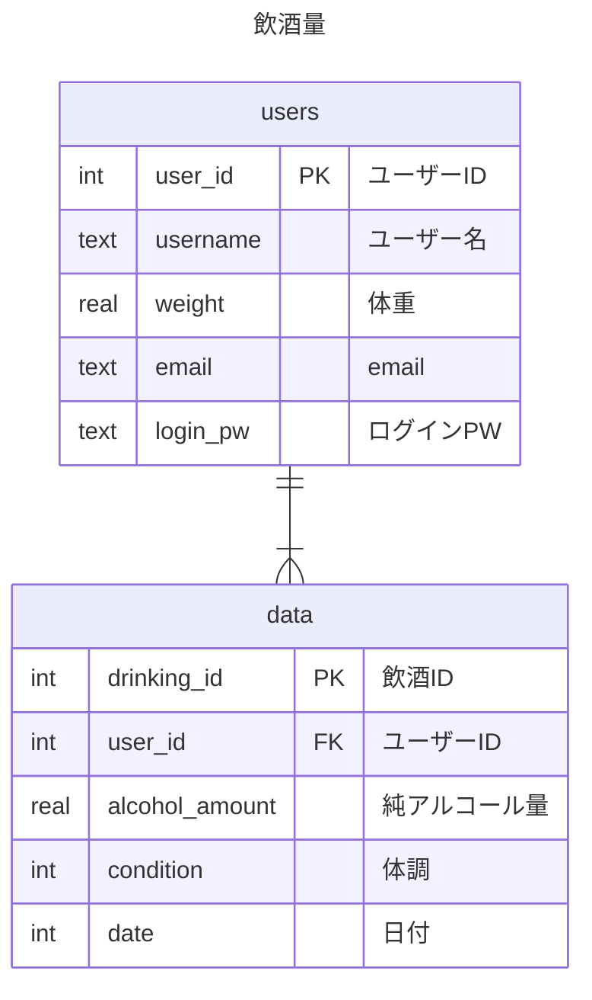

# Alcoho-Rhythm

# ER図

## tweetデータベース

```mermaid
---
title: "飲酒量"
---
erDiagram
    users ||--|{ data : ""

    users {
        int user_id PK "ユーザーID"
        text username "ユーザー名"
        real weight "体重"
        text email "email"
        text login_pw "ログインPW"
    }

    data {
        int drinking_id PK "飲酒ID"
        int user_id FK "ユーザーID"
        real alcohol_amount "純アルコール量"
        int condition "体調"
        int date "日付"
    }
```